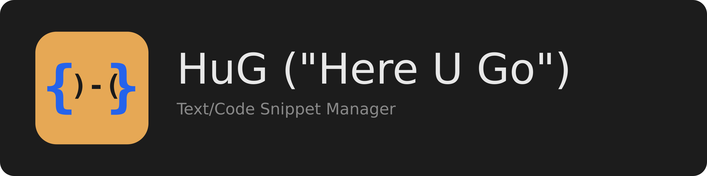

# HuG - Cross-Platform Snippet Manager

HuG is a cross-platform (Windows, Linux, macOS) text and code snippet manager designed for developer productivity.

## Installation

### From Release
1. Download `hug-linux.zip` (or platform equivalent).
2. Extract the archive.
3. Run the `hug` executable inside the extracted folder.

### From Source
1. Clone the repository.
2. Create a virtual environment: `python -m venv .venv && source .venv/bin/activate`.
3. Install dependencies: `pip install -r requirements.txt`.
4. Run: `python -m hug`.

## Features
- **System Tray**: Quick access to snippets via context menu.
- **Floating Palette**: Summon with `Ctrl+Shift+Space` (configurable) to search and insert snippets.
- **Snippet Management**: JSON-based snippet libraries.
- **Live Reload**: Edit JSON files and see changes instantly.
- **Cross-Platform**: Built with Qt (PySide6).

## Development
See `dev-docs/HuG-02-IMPLEMENTATION-GUIDE.md` for details.
