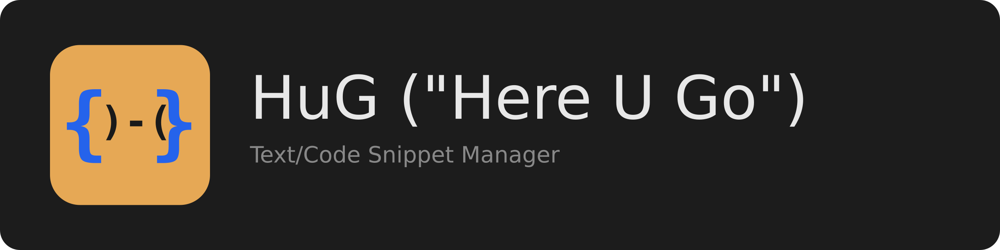
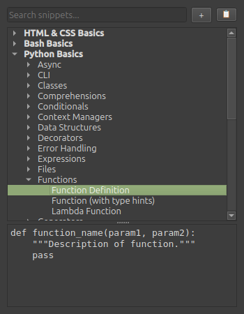

# HuG - Cross-Platform Snippet Manager



HuG is a cross-platform (Windows, Linux, macOS) text and code snippet manager designed for developer productivity.

## Installation

### From Release
1. Download the archive for your platform: `hug-windows.zip`, `hug-linux.zip`, or `hug-macos.zip`.
2. Extract the archive.
3. Run the `hug` (or `hug.exe` on Windows) executable inside the extracted folder.

### From Source
1. Clone the repository.
2. Create a virtual environment: `python -m venv .venv && source .venv/bin/activate`.
3. Install dependencies: `pip install -r requirements.txt`.
4. Run: `python -m hug`.

## Features
- **System Tray**: Quick access to snippets via context menu.
- **Floating Palette**: Summon with `Ctrl+Shift+Space` (configurable) to search and insert snippets.
- **Snippet Management**: JSON-based snippet libraries.
- **Live Reload**: Edit JSON files and see changes instantly.
- **Cross-Platform**: Built with Qt (PySide6).

## Development
See `dev-docs/HuG-02-IMPLEMENTATION-GUIDE.md` for details.

## Building from Source

PyInstaller does not cross-compile: you must run the build **on** the OS
you're targeting (build on Windows to get a Windows exe, on Linux for a
Linux binary, on macOS for a macOS binary). The build produces a native
executable in `dist/hug/` plus a `dist/hug-<platform>.zip` archive
(`hug-windows.zip`, `hug-linux.zip`, or `hug-macos.zip`).

1. Create and activate a platform-specific venv:
   - **Linux/macOS**: `python -m venv venv && source venv/bin/activate`
   - **Windows**: `python -m venv venv-win` then `venv-win\Scripts\activate` (or `source venv-win/Scripts/activate` in Git Bash)
2. Install runtime *and* dev dependencies (dev deps include PyInstaller):
   ```
   pip install -r requirements.txt -r requirements-dev.txt
   ```
3. Run the build script:
   ```
   python scripts/build.py
   ```

The script auto-detects the current OS and names the output archive
accordingly. If PyInstaller isn't installed, it'll tell you rather than
failing with a raw `FileNotFoundError`.

### Platform-specific notes
- **Linux**: needs Xlib available for `pynput`'s X11 backend (already
  pulled in as a hidden import in `package/hug.spec`); Wayland-only
  setups may need XWayland for global hotkeys to work.
- **Windows**: build from a `cmd`/PowerShell or Git Bash shell with the
  venv activated so `python` resolves to the venv's interpreter.
- **macOS**: not yet verified — the spec currently produces a onedir
  app, not a signed `.app`/`.dmg` bundle. Treat macOS builds as
  best-effort until that's set up.
